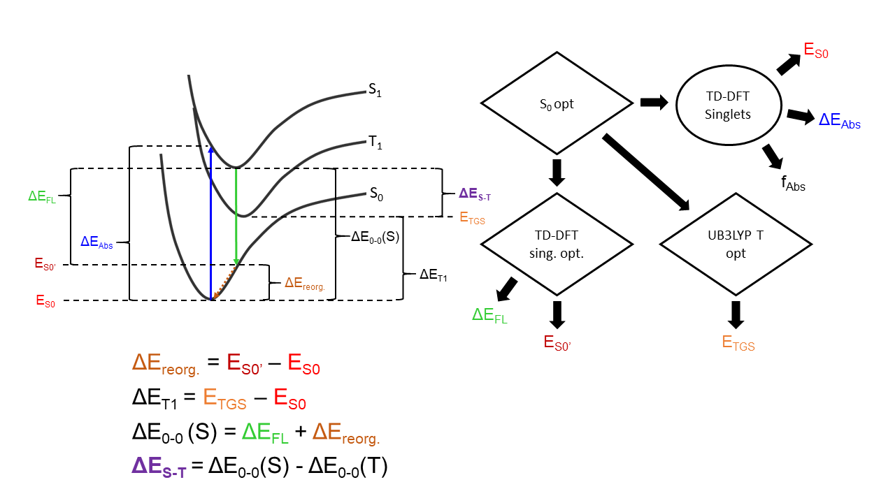

```
              @               
             @@@              
            @@@@@             
           @@ @@@@            
          @@   @@@@         @@@@@@@@@@@@      @@@@@@     @@@@@@@@@@@@     
         @@     @@@@        @@@@@@@@@@@@    @@@@@@@@@@   @@@@@@@@@@@@    @@
        @@       @@@@       @@         @   @@         @  @    @@    @                                     @
       @@         @@@@      @@@@@@@         @@@@@@@@          @@         @@@   @@@ @@ @@ @      @@@@@    @@      @@@@@@
      @@           @@@@     @@@@@@@           @@@@@@@@        @@         @@     @@@  @  @@@         @@  @@@@@   @@    @@
     @@             @@@@    @@         @   @         @@       @@         @@     @@       @@    @@@@@@@   @@     @@@@@@@@   
    @@@@@@@@@@@@@@@@@@@@@   @@@@@@@@@@@@    @@@@@@@@@@        @@         @@     @@       @@   @@    @@   @@     @@      
   @@@@@@@@@@@@@@@@@@@@@@@  @@@@@@@@@@@@      @@@@@@        @@@@@@      @@@@   @@@@     @@@@   @@@@ @@@   @@@    @@@@@@
```
```
~~~~~~~~~~~~~~~~~~~~~~~~~~~~~~~~~~~~~~~~~~~~~~~~~~~~~~~~~~~~~~~~~~~~~~~~~~~~~~~~~~~~~~~~~~~~~~~~~~~~~~~~~~~~~~~~~~~~~~~~~~~~
~                                               ΔESTimate Workflow, Version 1.2                                            ~
~                                             for Singlet-Triplet gap calculation                                          ~
~                                      Cory Ruchlin, McGill University Dept. of Chemistry                                  ~
~                                                      Montréal, QC, CANADA                                                ~
~                                                     coryruchlin@gmail.com                                                ~
~                                                         21 April 2021                                                    ~
~~~~~~~~~~~~~~~~~~~~~~~~~~~~~~~~~~~~~~~~~~~~~~~~~~~~~~~~~~~~~~~~~~~~~~~~~~~~~~~~~~~~~~~~~~~~~~~~~~~~~~~~~~~~~~~~~~~~~~~~~~~~
```


## Description of workflow:

ΔESTimate is a script that runs three Gaussian16 calculations on any closed-shell organic molecular system. Beginning with a 
geometry optimization of the ground state, the input file of which is created by the user, the script will automatically 
extract the optimized geometry and create input files for the three excited state calculations. Once all of the calculations
are complete, the script will then extract and print the necessary information and calculate the S1-T1 energy gap (ΔEST) in a 
text file. This workflow is most useful for high-throughput theoretical screening of Thermally Activated Delayed 
Fluorescence (TADF) candidates, or other photosystems in which the ΔEST is crucial to determining the photophysical 
properties. 

This is done by means of a submission launch file (`DESTimate-SUB.sh`), which is reusable allowing each user to maintain their
own copy, and four template files, which should be saved in a shared folder, accessible to every user in the group (see 
"Helpful Code" section). When run properly (see "How to run" section below), the launch file will retrieve and edit the 
template files for the designated system and prepare them for running. The templates consist of a job submission template
(`DESTimate.templ`), which handles the majority of the execution, namely writing Gaussian input files, interfacing with 
ComputeCanada's slurm controller, and writing the output file. This template is modified and sent to the working directory
as a bash file (`DEST-ZZ.sh`) which is batch submitted to the slurm controller. The other three templates (`sing_header.templ, 
singsp_header.templ, and tgs_header.templ`, collectively referred to as the `headers`) are used in the creation of the 
Gaussian input files. They are retrieved and edited by the launch file, then concatenated with the coordinate file 
generated by the job submission file once the ground state optimization calculation is complete.    


## Theory:

The templates for this script are written to run on the B3LYP/6-31G(d) level of theory. If a different functional or basis 
set is needed for your own personal use, the templates can be edited to work on higher levels of theory, see "Editing 
Templates" under the "Setup" section.

Following the ground state optimization, the script will run three excited state calculations to determine the energetics of 
these states (See Figure1.png). First, a single-point (Energy) TD-DFT calculation is used to determine the ground state 
energy (ES0), S1 absorption energy (ΔEAbs), and S1 absorption oscillator strength (fAbs). Next, optimization of the so-called
"triplet ground state" (T1 for most molecules) is used to determine the absolute energy of the system in its T1 state (ETGS).
Finally, an excited state optimization of the singlet is performed using TD-DFT to determine the fluorescence energy (ΔEFl) 
and S0 energy at the excited state geometric coordinate (ES0'). From these output parameters, the ground state reorganization
energy (ΔEreorg), relaxed S0-S1 energy gap (ΔE0-0) and relaxed S0-T1 energy gap (ΔET1) are calculated using the formulae
shown in Figure1.png.  



## Setup:

This workflow is written specifically for use on ComputeCanada's Graham or Cedar clusters in the Perepichka Reseach Group, if
you wish to implement it in another group, the template files (included in the `TEMPLATES` folder) will need to be uploaded to
a directory accessible to your group. It is suggested that this be a shared directory within the `/projects/` filesystem,
with read and execute permissions for group members (See "Helpful Code" section). The `dir` variable in the submission launch 
file will also need to be modified to access this directory. For implementation on other clusters or software environments, 
idk you're on your own.

Before using ΔESTimate for the first time, ensure that the template files are in place for the cluster you plan on using. If
you're in the Perepichka Group, these should already be in place (`/projects/6002427/shared/DESTimate_TEMPLATES/`), but just 
to be safe, check that all the necessary template files (listed above in the "Description of Workflow" section) are present.
If this directory or any of the templates are missing, they are included here in the TEMPLATES folder, simply recreate the 
folder under the same path if needed and upload them, ensuring that the proper permissions are set for this directory (See
"Helpful Code" section).

ΔESTimate must be run using very specific file organization, to ensure that the script works properly, follow these
instructions for setting up your directories: 

1) Create a directory in which you can save all the calculation files used and generated by ΔESTimate. This can 
theoretically be anywhere on the cluster. Here, I will refer to this directory as your `DESTFolder`, but the name can 
be anything you wish. NOT ALL THE FOLDERS IN THIS SCHEME GIVE YOU FULL NAMING LIBERTY, BE SURE TO FOLLOW THE NEXT STEPS 
CAREFULLY.

2) Edit the included DESTimate-SUB.sh with the following information in Lines 3-7:

	```
	user=username			(Replace "username" with your ComputeCanada username)
	mem=64G 			(Use this line to modify the allocated memory, by default I've set it to 64G)
	time=00-23:59			(Use this line to modify the alloted time for ALL FOUR calculations to run) 
	email=your.name@mail.mcgill.ca  (Enter your email here to recieve notifications from the slurm controller,
					if you don't want emails, try leaving this dummy address in. You may recieve
					an error message, but the calculations should proceed as normal anyway)
	
	dir=/project/6002427/shared/DESTimate_TEMPLATES
					(Leave this variable as is, unless the templates are being stored in a different
					directory, in which case, replace the full path to said directory, without the
					final /)
	```
	For the mem and time variables, the default variables should be sufficient for most small molecule systems and left as they
are, if you find they are insufficient you can use these tags to modify them without altering the template files.

3) Upload your now personal `DESTimate-SUB.sh` to your DESTFolder

4) When you have a chemical system which you want to analyze with ΔESTimate, generate an input file for the GS geometry 
optimization WITH FREQUENCY CALCULATION (if you do not include the freq calculation, the first completion check will
fail and the job will be aborted). Save this input file as `ZZ_gs.gjf`, where `ZZ` is any name you wish to give the system.

5) Within your DESTfolder, create a subdirectory, with the same name (`ZZ`) as your system, this is case sensitive and must
match exactly. Upload `ZZ_gs.gjf` to this subdirectory.
   
   Your directory should look as such:
```
	.
	└─DESTfolder
  	  ├─DESTimate_SUB.sh
   	  └─ZZ
     	    └─ZZ_gs.gjf   

```
You should now be ready to run ΔESTimate on this system. ΔESTimate is written to allow you to submit jobs on multiple
systems in parallel. The directories for any additional systems must be set up the same way with their own destinct names.
N.B. Avoid using spaces or any special characters that bash may attempt to parse in the system names. 

* Editing Templates:
DO NOT MODIFY the templates that are placed in the shared directory. If you need the change anything in either the headers
or the job submission template, create a copy and edit the `dir` variable in the launch file accordingly. If you have the 
technical specs to know which higher level of theory you wish to use, I'll trust that you have the wherewithall to know how 
to copy and redirect as needed. The headers contain all of the specifications on functional and basis set and, again, if 
you're at the point where you want to modify these, I'm sure you can figure out how they need to be changed. 


## How to run:

Once you've completed all the steps in the `Setup` section you should be ready to submit your job. Open DESTimate_SUB.sh in
any text editor and input all the system names you wish to run in individual quotation mark sets in the for loop in line 9.

E.g. if you wish to submit three systems, XX, YY, and ZZ, line 9 should read:
	
	for n in "XX" "YY" "ZZ"  

Save these changes and ensure that the file has been uploaded. Ensure that you are working in your DESTfolder directory, and
move there if necessary. Finally, you can submit the job by runing the following line in your terminal:

	$ sh DESTimate_SUB.sh 

The script will now start running, you should see confirmation of all job submissions from the slurm controller and your job
queue printed after a few seconds.

DESTimate_sub.sh is designed to be reusable. To run on a new system, create a new subdirectory following the guidelines in 
the "Setup" section and change the name in line 9 of DESTimate_SUB.sh as shown above.  

## Retrieving results:

Once all of the calculations are complete, ΔESTimate will generate an output file titled `ZZ_OUTPUT.log` with all of the 
parameters shown in Figure1.png listed, as well as completion checks for the three excited state calculations. If these all
show that the calculation `terminated normally`, then the results are reliable (to within the limits of the level of 
theory). If any of these calculations are shown to have `failed`, then some or all of the parameters may be incorrect. If 
this is the case, you can check the individual .log files for these calcualtions to determine the problem. If the initial
ground state optimization fails within the time/memory/disk space limit, this is noted at the top of the OUTPUT file
and the job is aborted without running the excited state calculations. All of the Gaussian ouput files are left in place in
the subdirectories for your use/examination, and all temporary files generated by ΔESTimate are deleted automatically.     


## Helpful Code:

* Setting permissions for template directory
  `$ chmod 755 [DIRECTORY]`
* ~Deleting temporary files if job crashed (EXECUTE ONLY FROM WITHIN SYSTEM SUBDIRECTORY ("ZZ"))
  `$ rm *.tmp`
* ~Open nano editor for editing files
  `$ nano [FILENAME]`
* ~Open vim editor for editing files 
  Don't use vim, nano is better
* ~Quick print file terminal
  `$ cat [FILENAME]`